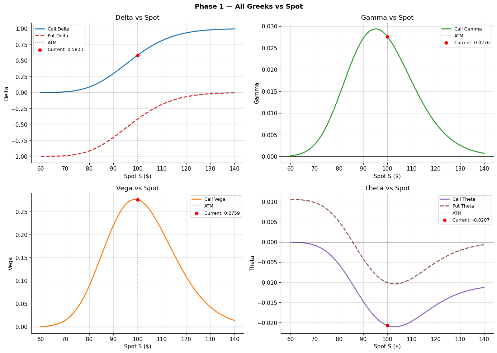
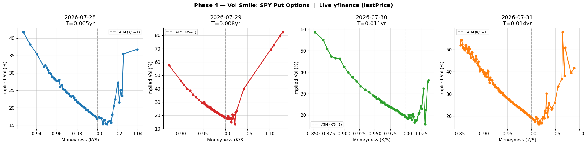
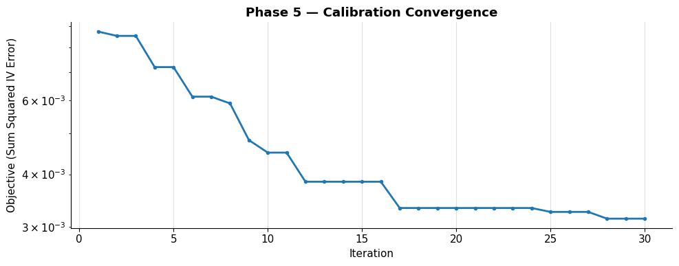
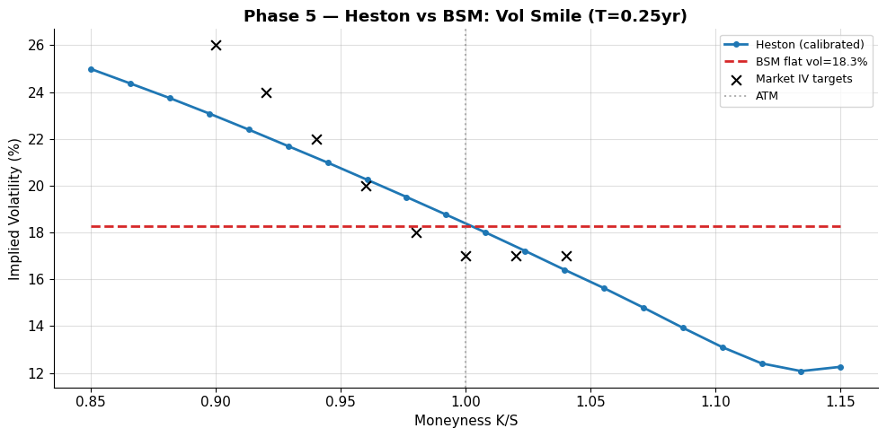
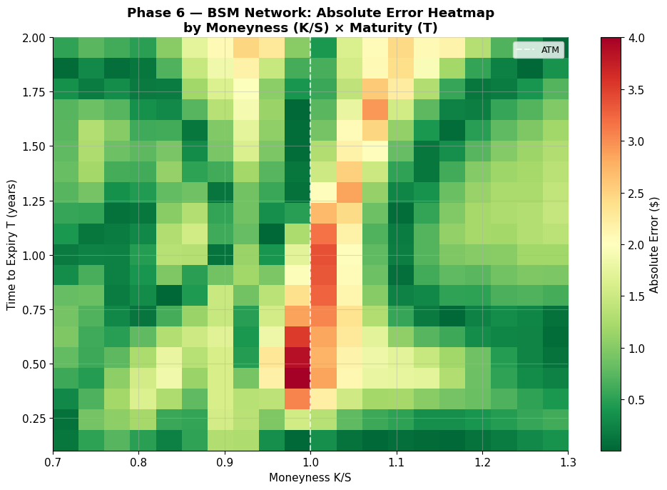
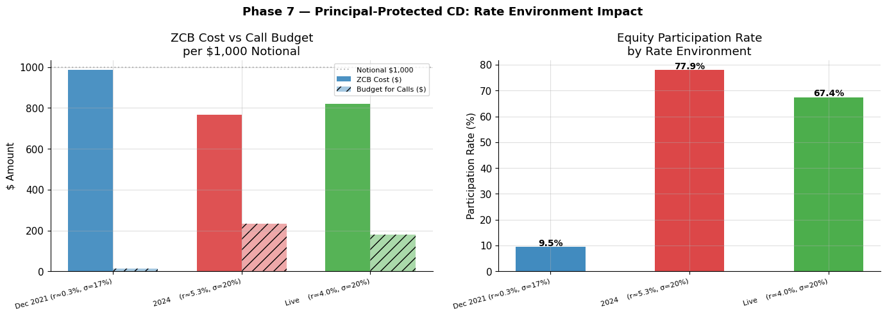

# Derivatives Pricing, Greeks, Heston & Structured Products

A derivatives pricing suite built from first principles in Python: Black-Scholes and binomial trees, all five Greeks, delta-hedging simulation, a Heston stochastic-volatility model with Monte Carlo variance reduction, a neural-network price approximator, and a principal-protected structured product. Measured against the live SPY volatility skew.

*Boopesh Mohanraj*

---

## What this is

Most derivatives desk work comes back to three questions:

- **What is an option actually worth, and why?**
- **Why does flat-volatility Black-Scholes systematically misprice out-of-the-money options?**
- **How do you structure a payoff (like a principal-protected note) that a client will actually buy?**

This project works through all three from the ground up, implementing every pricer by hand rather than calling a library, so that each component can be explained under interview pressure.

It runs seven phases: Black-Scholes from scratch, binomial-tree pricing (European, American, barrier), a delta-hedging simulation, live implied-volatility surface extraction, a Heston stochastic-volatility model, a feedforward neural network that learns the BSM pricing map, and a principal-protected equity-linked CD priced by replication and verified by Monte Carlo.

---

## Key results

Every figure and number below is a real output of the code in this repo. Where market data is used, it is genuine live data from the SPY options chain; where a model is calibrated to a representative smile rather than live quotes, that is stated explicitly.

| Component | What it produced |
|---|---|
| **Black-Scholes + Greeks** | All five Greeks analytically; put-call parity holds to machine precision |
| **Live SPY vol skew** | ATM IV 19.1%, downside puts ~20 vol points richer (measured from live chain) |
| **Heston calibration** | Converged to κ=3.98, long-run vol 18.3%, ρ=-0.94 (reproduces the skew) |
| **NN price approximator** | Learns the BSM surface at R² = 0.99, MAE ≈ $1 |
| **Structured product** | Participation swings <10% → ~78% across rate environments |

### Black-Scholes and the Greeks, from first principles

All five Greeks are implemented analytically and plotted against spot. Gamma and Vega peak at-the-money; Delta runs the familiar S-curve from 0 to 1; call and put Theta both decay. A Taylor-series P&L approximation (Delta + half-Gamma-squared + Vega) tracks the actual BSM repricing closely across ten shock scenarios, which is exactly the mental-math check a trader is expected to do live.



### The live SPY volatility skew, measured from the market

Pulling the live SPY options chain (spot **$738.93**) and inverting Black-Scholes for each strike recovers the equity volatility skew directly from market prices. At-the-money implied vol was **19.1%**, while puts 10% below spot traded about **20 vol points higher**. Flat-vol BSM prices every strike at one number and therefore systematically underprices these out-of-the-money puts, which is the entire motivation for a stochastic-volatility model.



### Heston reproduces the skew that BSM cannot

The Heston model was implemented with a full Monte Carlo engine (Euler discretization, antithetic and control variates for variance reduction) and calibrated with a differential-evolution optimizer over the five Heston parameters. Calibration converged to economically sensible values: mean-reversion **κ = 3.98**, long-run volatility **18.3%**, and leverage correlation **ρ = -0.94**. That strongly negative ρ is the mathematical source of the skew: down moves and volatility spikes are correlated, so the model naturally prices a higher vol for downside strikes, the exact shape a flat BSM line misses.





*Calibration note: the Heston parameters were fit to a representative equity smile (a stylized SPY-style term structure), not to live market quotes. The live-market measurement above and the calibration exercise here are separate steps; the calibration demonstrates that the engine reproduces the skew shape, not that these specific parameters were fit to that day's SPY surface.*

### Neural network learns the BSM pricing map

A feedforward network trained on generated (S, K, T, r, sigma) to BSM-price pairs approximates the pricing function with **R-squared = 0.99** and mean absolute error near one dollar. This is deliberately not deep hedging (which requires stochastic optimal-control theory); it is an honest demonstration that a network can learn the pricing surface, with the largest residuals concentrated at-the-money near expiry where the price surface is most curved.



### Principal-protected structured product

A principal-protected equity-linked CD was priced by replication (a zero-coupon bond plus equity call options) and verified by Monte Carlo. The interesting result is the rate sensitivity: participation in the equity upside swings dramatically with the rate environment, because higher rates make the protective bond cheaper and free up budget for calls. Across illustrative rate/vol scenarios the participation rate ran from under 10% in a near-zero-rate environment to roughly 78% in a higher-rate one, which is precisely why these products regained popularity after 2022.



---

## Methodology and academic references

Each component implements a specific paper. For each: what the paper gives, what I built, and what it produced here.

### Black-Scholes and the Greeks
*Black & Scholes (1973)*

- **Built:** the closed-form call and put via d1/d2 by hand, put-call parity as a self-check, and all five Greeks analytically. A Taylor-series P&L expansion approximates repricing under joint spot and vol shocks.
- **Result:** put-call parity holds to machine precision; the Taylor approximation tracks actual BSM repricing across ten shock scenarios.

### Binomial-tree pricing
*Cox, Ross & Rubinstein (1979)*

- **Built:** the CRR up/down/probability parameters, European and American options (with the early-exercise decision at each node), a barrier knock-out, and a convergence demonstration toward the BSM price as steps increase.
- **Result:** the American put carries an early-exercise premium over its European counterpart; the knock-out is cheaper than the vanilla, as expected.

### Delta hedging
*Black & Scholes (1973), replication argument*

- **Built:** a discrete-rebalancing delta hedge of a short call, comparing a low-volatility path against a high-volatility path.
- **Result:** hedging error and Gamma P&L are visibly larger on the high-vol path, which is the concrete illustration of short-Gamma risk that a trader is asked to explain.

### Implied volatility surface
*Market data via Black-Scholes inversion*

- **Built:** Brent root-finding to invert BSM for the implied vol of every liquid SPY put across strikes and expiries, pulled live from the options chain.
- **Result:** a measured equity skew (ATM 19.1%, downside puts about 20 vol points richer), the empirical fact that motivates stochastic volatility.

### Heston stochastic volatility
*Heston (1993)*

- **Built:** a Monte Carlo Heston engine with antithetic and control-variate variance reduction, calibrated over the five parameters by differential evolution, with a Feller-condition check.
- **Result:** converged to κ = 3.98, long-run vol 18.3%, ρ = -0.94, bending the flat BSM vol line into the observed downside skew. Calibration was to a representative smile (see note above), not live quotes.

### Neural network price approximator
*Feedforward function approximation (not deep hedging)*

- **Built:** a feedforward network trained on generated BSM price data across the input space.
- **Result:** R-squared = 0.99, MAE near one dollar, with residuals largest at-the-money near expiry. Framed honestly as function approximation, not a research-grade hedging model.

### Structured product
*Hull (2018), principal-protected note replication*

- **Built:** a principal-protected equity-linked CD priced by replication (zero-coupon bond plus calls) and cross-checked by Monte Carlo, with a participation-rate sensitivity across rate and vol environments.
- **Result:** participation swings from under 10% to roughly 78% as rates rise, explaining the product's post-2022 revival. The 2021 and 2024 comparison points use illustrative rate/vol inputs, not pulled historical data.

---

## Tech stack

| Layer | Tools |
|---|---|
| **Language** | Python |
| **Pricing & math** | NumPy, SciPy (Brent root-finding, differential evolution), pandas |
| **Machine learning** | PyTorch (feedforward approximator) |
| **Data** | yfinance (live SPY options), FRED (risk-free rate) |
| **Visualization** | Matplotlib (static), Plotly (interactive 3D surfaces) |

---

## Repository structure

```
quant_p2.py       Full 7-phase pricing suite (single Colab notebook export)
figures/          Selected result visualizations
requirements.txt  Dependencies
```

---

## Data and limitations

Stated plainly:

- **Heston calibration target.** Parameters were fit to a representative equity smile, not live market quotes. The live-market skew measurement and the calibration are separate demonstrations.
- **Calibration method.** Heston is calibrated by Monte Carlo pricing inside a differential-evolution loop, which is transparent but slow (several minutes). The semi-analytic characteristic-function approach would be materially faster and is the production-standard choice; the MC route was chosen here for clarity of implementation.
- **Structured product scenarios.** The 2021 and 2024 rate/vol inputs are illustrative stylized values, not pulled historical data; only the live scenario uses the fetched FRED rate.
- **yfinance option quotes.** Uses last-traded price, which can be stale outside market hours; bid/ask midpoints during market hours would be cleaner.
- **Neural network scope.** A feedforward BSM approximator, not deep hedging. It learns the pricing map; it does not solve a hedging control problem.
- **Historical option chains.** yfinance does not serve historical option surfaces, so all live-market work reflects the current chain rather than a chosen past date.

---

* Data from public APIs (yfinance, FRED) *
